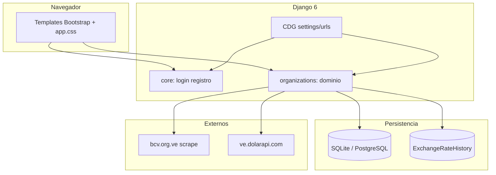
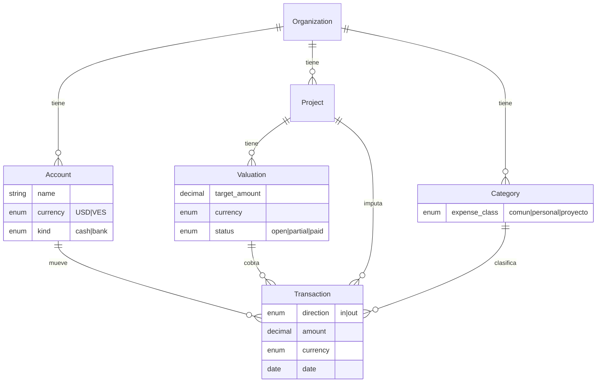

# Auditoría del sistema — Control de Gastos (Django)

**Fecha:** 26 de mayo de 2026  
**Alcance:** Estructura del proyecto, funcionamiento actual y alineación con el negocio (ingresos por valuación en partes, gastos comunes/personal, cajas VES y USD separadas).  
**Modo:** Revisión de código y arquitectura (sin cambios aplicados en esta entrega).

---

## 1. Resumen ejecutivo

El sistema es una aplicación Django orientada a **organizaciones** que registran **transacciones** (ingresos/egresos), **proyectos**, **valuaciones** (hitos de ingreso esperados) y **cuentas** (cajas). Cubre bien el registro básico, el histórico BCV y reportes PDF, pero **no modela de forma explícita** varios requisitos centrales del negocio:

| Requisito de negocio | Cobertura actual | Nivel |
|----------------------|------------------|-------|
| Ingresos por valuación cobrados en varias partes | Parcial (varias transacciones + % en proyecto) | 🟡 |
| Cajas distintas para VES y USD | No (una cuenta con saldo dual) | 🔴 |
| Gastos comunes vs personal | No (solo categorías libres) | 🔴 |
| Tasa BCV por fecha de operación | Sí (histórico + validaciones) | 🟢 |
| Multi-organización y usuarios | Sí | 🟢 |

**Conclusión:** La base técnica es usable para operación controlada, pero para reflejar fielmente la operación de la empresa (dos cajas reales, cobros parciales auditables, gasto operativo vs nómina) conviene una **fase de diseño de dominio** antes de seguir ampliando pantallas.

---

## 2. Contexto de negocio (referencia)

La empresa necesita:

1. **Ingresos** ligados a **valuaciones** de proyectos; un mismo hito puede cobrarse en **varios abonos** que suman el total de esa valuación.
2. **Gastos** de dos naturalezas: **comunes** (operación, servicios, insumos) y **de personal** (nómina, beneficios, etc.).
3. **Dos monedas** (VES y USD) con **cajas físicas/contables separadas**: lo que entra o sale en bolívares no debe mezclarse contablemente con la caja en dólares en la misma “bolsa” lógica.

El sistema actual trata USD y VES como **columnas en la misma transacción** y las cuentas como **contenedores genéricos sin moneda base**.

---

## 3. Arquitectura actual



### 3.1 Apps y responsabilidades

| Componente | Rol |
|------------|-----|
| **CDG** | Configuración global: BD, static, timezone `America/Caracas`, WhiteNoise |
| **core** | Autenticación (`/core/login/`, registro, logout) |
| **organizations** | Todo el dominio financiero y UI principal |

### 3.2 Flujo operativo típico

1. Usuario inicia sesión → elige **organización** (sesión `org_id`).
2. Opera en **Inicio** (KPIs), **Transacciones**, **Cuentas**, **Proyectos**.
3. Crea **valuaciones** en un proyecto; registra **ingresos** como transacciones positivas (opcionalmente enlazadas a valuación).
4. Registra **gastos** como transacciones negativas (signo en frontend).
5. Exporta **PDF** de transacciones filtradas.
6. Tasas BCV: comando `fetch_bcv_rates` + consulta por fecha al guardar.

---

## 4. Estructura de carpetas (auditoría Django)

### 4.1 Estructura recomendada vs observada

```
control-gastos-app-django/
├── CDG/                    ✅ Proyecto activo
├── core/                   ✅ Auth
├── organizations/          ✅ Dominio (monolito en views.py)
│   ├── models.py
│   ├── views.py            ⚠️ ~860 líneas — candidato a dividir
│   ├── forms.py
│   ├── services/           ✅ bcv_scraper
│   ├── management/commands/ ✅ fetch_bcv_rates
│   └── pdf_reports/        ✅ ReportLab
├── templates/
│   ├── base.html           ✅ Layout global
│   ├── core/               ✅ Auth
│   └── organizations/      ✅ Pantallas negocio
├── static/css/app.css      ✅ Design system propio
├── conftest.py + pytest.ini ✅ Tests
├── manage.py
└── requirements.txt
```

### 4.2 Hallazgos estructurales

| Hallazgo | Severidad | Recomendación |
|----------|-----------|----------------|
| Carpetas legacy **`accounts/`** y **`myproject/`** aún en el árbol | Alta | Eliminar tras confirmar que nada apunta a `myproject.settings` |
| **`templates/accounts/`** duplicado de `templates/core/` | Media | Borrar `templates/accounts/` |
| **`templates/organizations/reportes/transacciones_pdf.html`** sin uso (PDF vía ReportLab) | Baja | Eliminar o documentar como archivo histórico |
| **`static/js/base.js`** vacío; JS en `base.html` inline | Baja | Mover JS a `static/js/base.js` y referenciarlo |
| **`organizations/views.py`** concentra CRUD, BCV, filtros, PDF | Media | Dividir en `views/` o `services/` por módulo |
| Sin capa **`selectors/` / `services/`** de dominio (solo BCV) | Media | Extraer reglas de negocio fuera de vistas |
| **`generate_dbml.py`** sin `ExchangeRateHistory` | Baja | Actualizar diagrama ER |
| **`requirements.txt`** mezcla prod y dev (pytest) | Baja | `requirements-dev.txt` para CI local |

### 4.3 Configuración Django (`CDG/settings.py`)

| Aspecto | Estado | Riesgo |
|---------|--------|--------|
| `SECRET_KEY` en código | 🔴 | Rotar y usar variable de entorno |
| `DEBUG` default `True` | 🔴 | Forzar `False` en producción |
| Sin `CACHES` explícito | 🟡 | Caché LocMem por worker (BCV inconsistente) |
| Sin `CSRF_TRUSTED_ORIGINS` | 🟡 | Revisar en dominio HTTPS (Render) |
| `STATICFILES_DIRS` + Manifest storage | 🟢 | Correcto con `collectstatic` |

---

## 5. Modelo de datos y alineación con el negocio

### 5.1 Entidades principales

```
Organization ──┬── Account (caja genérica)
               ├── Category (etiqueta libre)
               ├── Project
               │      └── Valuation (monto esperado USD/BS + tasa)
               └── Transaction (movimiento; signo = ingreso/egreso)
                      ├── FK account (obligatorio)
                      ├── FK project, valuation (opcionales)
                      └── amount_usd, amount_bs, daily_rate
```

### 5.2 Valuaciones e ingresos en partes

**Qué hace hoy**

- `Valuation` guarda el **monto objetivo** (`amount_usd`, `amount_bs`, `daily_rate`).
- Los **cobros parciales** son `Transaction` con `valuation` y montos **positivos**.
- En `detalle_proyecto`, el avance es:  
  `sum(transacciones positivas en USD) / valuation.amount_usd` (tope 100%).

**Limitaciones**

| Limitación | Impacto |
|------------|---------|
| No existe entidad **Abono / Cuota** | Difícil auditar “cuota 2 de 5” con vencimiento |
| No valida que Σ cobros ≤ monto valuación | Riesgo de sobrecobro en datos |
| Progreso solo en **USD** | Si cobran en Bs, el % puede ser engañoso |
| `valuation` y `project` son opcionales en transacción | Ingresos de proyecto sin trazabilidad |
| `status` (pendiente/completado) no modela cobro parcial | Confusión con estado de pago |

**Recomendación**

- Introducir **`PaymentAllocation`** o flag `is_collection=True` con reglas en `Transaction.clean()`.
- Estados de valuación: `pendiente` | `parcial` | `cobrada` | `cancelada` (calculado o persistido).
- Obligar: si `valuation` está definida → `project` debe coincidir y moneda del movimiento debe alinearse con la caja.

### 5.3 Cajas VES vs USD (requisito crítico)

**Qué hace hoy**

- `Account` solo tiene `name`; no tiene `currency` ni `account_type`.
- Cada `Transaction` guarda **ambos** montos; el saldo de cuenta suma `amount_usd` y `amount_bs` por separado en agregaciones.
- El usuario elige visualmente USD o Bs al capturar, pero el movimiento sigue siendo **bimonetario en una sola fila**.

**Por qué no cumple “caja distinta”**

- Una “Caja Banco Banesco USD” y una “Caja Efectivo Bs” deberían aceptar **solo movimientos en su moneda**.
- Hoy se puede registrar USD y Bs en la misma cuenta y la misma transacción, lo que **duplica la lógica contable** si operan cajas reales separadas.

**Recomendación (modelo objetivo)**

```python
class Account(models.Model):
    class Currency(models.TextChoices):
        USD = "USD", "Dólares"
        VES = "VES", "Bolívares"

    class AccountKind(models.TextChoices):
        CASH = "cash", "Caja"
        BANK = "bank", "Banco"
        OTHER = "other", "Otro"

    currency = models.CharField(max_length=3, choices=Currency.choices)
    kind = models.CharField(max_length=10, choices=AccountKind.choices, default=AccountKind.CASH)
```

- `Transaction` debería tener **un solo monto principal** (`amount` + `currency`) derivado de la cuenta; la contrapartida en otra moneda solo como **referencia** o en asiento de conversión explícito.
- Validar en formulario: cuenta VES → solo `amount_bs` (o solo campo `amount`); cuenta USD → solo USD.

### 5.4 Gastos comunes vs personal

**Qué hace hoy**

- `Category` es texto libre + color; no hay tipo de gasto.
- No hay centro de costo, departamento ni nómina.

**Recomendación**

- Añadir en `Category` (o nuevo modelo `ExpenseClass`):

  | Código | Uso |
  |--------|-----|
  | `operativo` | Gastos comunes |
  | `personal` | Nómina y relacionados |
  | `proyecto` | Costos directos de obra (opcional) |

- Reportes: P&amp;L por clase + por proyecto + por caja (moneda).
- Opcional futuro: módulo **nómina** que genere transacciones recurrentes en caja VES.

### 5.5 Campos huérfanos

En `Transaction` existen `real_dollars` y `real_dollar_rate` **sin uso** en forms ni vistas.  
Útiles si manejan **dólar paralelo** distinto del BCV; si no, eliminar o implementar en UI.

---

## 6. Funcionamiento por módulo

### 6.1 Transacciones

| Función | Estado |
|---------|--------|
| CRUD con modales | ✅ |
| Ingreso/egreso por signo (JS) | ✅ Funcional; frágil para reportes |
| Fecha no futura | ✅ |
| Tasa BCV histórica / manual en fechas pasadas | ✅ |
| Filtros y paginación | ✅ |
| PDF export | ✅ ReportLab |
| Tipo de movimiento en BD | ❌ Solo signo numérico |

### 6.2 Cuentas (cajas)

| Función | Estado |
|---------|--------|
| Crear cuenta con saldo inicial | ✅ (transacción automática) |
| Saldo USD y Bs en tarjeta | ✅ |
| Moneda única por caja | ❌ |
| Transferencias entre cajas | ❌ |

### 6.3 Proyectos y valuaciones

| Función | Estado |
|---------|--------|
| CRUD proyecto / valuación | ✅ |
| Barra de cobro parcial | ✅ (solo USD) |
| Registrar cobro desde valuación | 🟡 Manual en transacciones |
| Alertas sobrecobro | ❌ |

### 6.4 Tasas BCV

| Función | Estado |
|---------|--------|
| Histórico diario (`ExchangeRateHistory`) | ✅ |
| Comando `fetch_bcv_rates` | ✅ |
| Scrape en request (home) | ⚠️ Latencia / fragilidad |
| Fallback tasa = 1 | 🔴 Riesgo contable |

### 6.5 Seguridad y permisos

| Función | Estado |
|---------|--------|
| Login / registro | ✅ |
| Aislamiento por `org_id` en sesión | ✅ |
| Roles (contador, operador, solo lectura) | ❌ |
| Auditoría de cambios | ❌ |

---

## 7. Inconsistencias detectadas

1. **Filtros de período:** en inicio se usa `3months`; en transacciones/PDF se usa `quarter` — mismos ~90 días pero claves distintas (confusión en URLs y reportes).
2. **Filtro “último día” en home:** `get_filtered_totals_both` usa `now - 1 día` (rolling 24h), no “hoy” calendario.
3. **Preferencia de moneda:** solo afecta visualización (`localStorage`), no la caja ni los formularios por defecto.
4. **Doble fuente de tasas en dashboard:** BCV histórico + paralelo vía API; no está documentado cuál usar para conversión operativa.

---

## 8. Matriz de brechas (negocio → sistema)

| # | Necesidad | Gap | Prioridad |
|---|-----------|-----|-----------|
| G1 | Caja solo VES y caja solo USD | `Account` sin moneda; transacción dual | **P0** |
| G2 | Cobros parciales trazables por valuación | Sin tope ni entidad de abono | **P0** |
| G3 | Gasto común vs personal | Sin clasificación | **P1** |
| G4 | No mezclar saldos entre cajas al transferir | Sin transferencias internas | **P1** |
| G5 | Reportes por moneda real de caja | KPIs mezclan ambas monedas | **P1** |
| G6 | Tasa BCV confiable sin fallback 1 | Mejorar errores y bloqueo | **P1** |
| G7 | Roles y auditoría | No implementado | **P2** |
| G8 | Limpieza legacy `accounts/`, `myproject/` | Deuda de migración | **P2** |

---

## 9. Recomendaciones priorizadas

### Fase 0 — Higiene técnica (1–2 días)

1. Eliminar `accounts/`, `myproject/`, `templates/accounts/`.
2. Mover `SECRET_KEY` y `DEBUG` a variables de entorno.
3. Configurar `CACHES` (Redis o DB cache) para tasas BCV.
4. Programar **cron** `fetch_bcv_rates`; quitar scrape síncrono de `home_organizacion`.
5. Si no hay tasa: **bloquear** guardado automático (no usar `1` silencioso).
6. Unificar claves de filtro (`quarter` vs `3months`).
7. Limpiar dependencias no usadas en `requirements.txt`.

### Fase 1 — Dominio financiero mínimo viable (1–2 semanas)

1. **`Account.currency`** (`USD` | `VES`) + validación en `TransactionForm`.
2. Un monto operativo por transacción según moneda de caja; segundo monto solo informativo o eliminado.
3. **`Category.expense_type`**: `comun` | `personal` | `proyecto`.
4. Validaciones valuación:
   - Σ cobros ≤ monto valuación (por moneda de referencia).
   - `valuation.project == transaction.project`.
5. Estado calculado de valuación (`parcial` / `cobrada`).
6. Reporte: flujo por caja y moneda; cobros pendientes por valuación.

### Fase 2 — Operación avanzada (2–4 semanas)

1. Modelo **`Transfer`** entre cuentas (misma u otra moneda con tasa explícita).
2. Pantalla **“Registrar cobro”** desde valuación (prellena proyecto, valuación, caja USD).
3. Dashboard: caja VES vs caja USD por separado; gasto común vs personal.
4. Tests pytest para reglas de caja y cobros parciales.
5. Roles: `OrganizationAccess.role` (`admin`, `operador`, `lectura`).

### Fase 3 — Escalabilidad (opcional)

1. API REST (DRF) para integraciones.
2. Conciliación bancaria.
3. Módulo nómina → asientos automáticos en caja VES.
4. Uso de `real_dollar_rate` si operan con dólar paralelo.

---

## 10. Modelo objetivo sugerido (visión)



---

## 11. Checklist de validación post-mejoras

- [ ] No se puede registrar USD en caja marcada VES (y viceversa).
- [ ] Un cobro parcial actualiza el % de valuación sin superar 100%.
- [ ] Reporte de gastos separa **común** y **personal**.
- [ ] Saldo de “Caja USD” solo suma transacciones USD de esa caja.
- [ ] Transacción con fecha pasada sin BCV exige tasa manual (ya implementado).
- [ ] `pytest` cubre reglas de caja y valuación.
- [ ] Sin carpetas `myproject/` ni `accounts/` en el repositorio.

---

## 12. Conclusión

El proyecto tiene una **base Django sólida** (multi-org, transacciones, valuaciones, BCV histórico, PDF, pytest) y una **UI core** reciente. Para el caso de uso descrito — **empresa con ingresos por valuación en abonos, gastos comunes y de personal, y dos cajas reales en VES y USD** — el gap principal no es de pantallas, sino de **modelo de dominio**: hace falta **moneda por caja**, **clasificación de gasto** y **reglas estrictas de cobro parcial**.

Priorizar **Fase 0 + Fase 1** antes de nuevos reportes o integraciones evitará retrabajo y datos inconsistentes en producción.

---

*Documento generado como entregable de auditoría. Para implementar las recomendaciones, abrir tareas por fase en el backlog del proyecto.*
